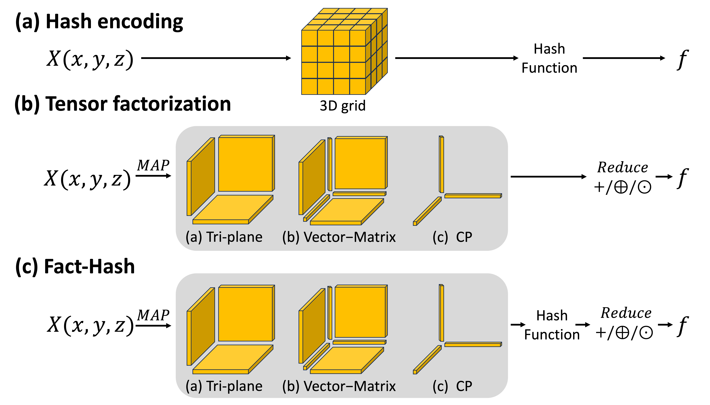

# Fact-Hash
# Uni-DVPS
### [Project Page](https://facthash.github.io/) | [Paper](https://facthash.github.io/)
This repository contains the official implementation of the RA-L 2024 paper, 
"Factorized Multi-Resolution HashGrid for Efficient Neural Radiance Fields: Execution on Edge-Devices".

## Acknowledgement
This work was supported by Institute of Information \& communications Technology Planning \& Evaluation (IITP) grant (No.RS-2022-II220290, Visual Intelligence for Space-Time Understanding and Generation based on Multi-layered Visual Common Sense; No.RS-2019-II191906, Artificial Intelligence Graduate School Program(POSTECH)) and National Research Foundation of Korea (NRF) grant (No. RS-2024-00358135, Corner Vision: Learning to Look Around the Corner through Multi-modal Signals) funded by the Korea government(MSIT). A portion of this work was carried out during an internship at NAVER AI Lab.
